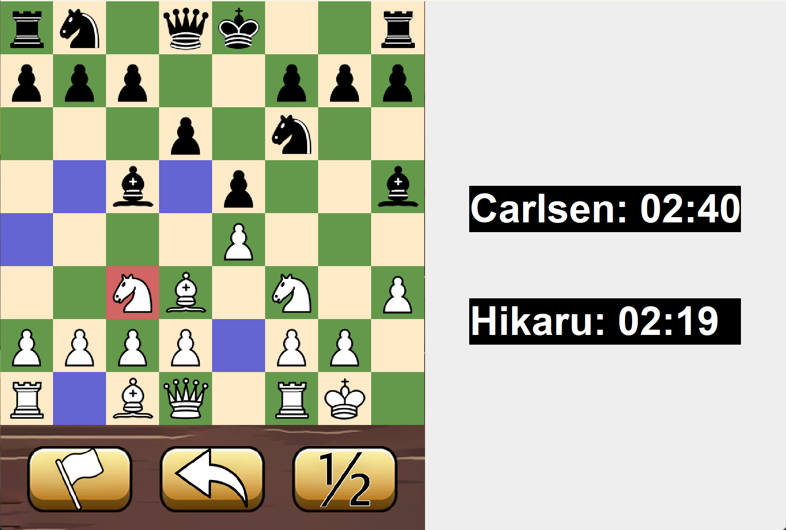

Original Source Code and Chess Game Directly Taken From: https://github.com/minimonomana/Chess_Game?tab=readme-ov-file

# Chess_Game
This is our team project for COMP1020 course, building a chess game using java programming language, named LỳChess with graphical user interface and including various game mode.

## Features

It strictly follow the Chess rules and have features:
1. Regular moves and captures of Pawn, Bishop, Rook, Night, Queen and King.
2. Special moves like En Passant, Castling and Pawn promotion.
3. Pinning mechanism and end game deciding include checkmate, stalemate. Also enable resigning and draw offering.
4. Allow undoing moves.
5. Set the timer.
6. Sound effects.
7. Chess variants, including Chess 960, Blindfold Chess and Advanced Blindfold Chess.



## Installation

To run Lychess on your local machine, please follow these steps:

1. Ensure you have Java Development Kit (JDK) installed on your computer (or refer [JDK Installation](https://docs.oracle.com/en/java/javase/17/install/overview-jdk-installation.html#GUID-8677A77F-231A-40F7-98B9-1FD0B48C346A))
2. There are two options when it comes to installing the program. you can download a compiled jar file, or you can download the source code and compile it yourself.
- Download the jar file and compile.
    - Download the jar file from [this link](https://github.com/minimonomana/Chess_Game).
    - Extract the file into the location you want and use an IDE to run it.

- Clone the repository.
    - Clone our repository using the following command
    ```shell
    git clone https://github.com/minimonomana/Chess_Game.git
    ```
    - cd to the folder you want to run the project and use your prefered IDE (Eclipse or VS Code).
3. Run the compiled code to start the LỳChess game.
- Run the ChessMenu class byrunning respectively:
    ```bash
    cd main
    ```
    ```bash
    javac ChessMenu.java
    ```
    ```shell
    java ChessMenu
    ```


- After that, your choose a mode you prefer, enter the name of two players, and start your game.


Here is an instance of Chess 960 game with white checkmated black


Here is the demo video for our project:
[LỳChess demo](https://www.youtube.com/watch?v=v4TVgKSJUFc)

## Authors
- Nguyen Duc Trung (minimonomana)
- Igor Kolegniskov (Spacmannn)
- Phan Nguyen Tuan Anh (nico-tuananh)
- Tran Hung Dat (Tho Sugoi)
# ChessGameFormalVerification
# ChessGameFormalVerification
# ChessGameFormalVerification
